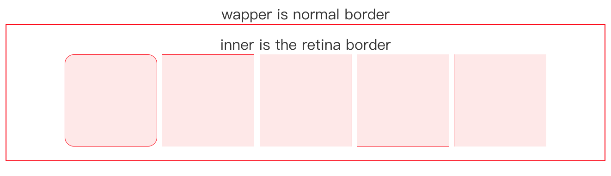

# PostCSS Retina [![Build Status][ci-img]][ci]
transform your border in retina without change anything.

## How It Works
use a **```::before```** element to create a scale border and replace the origin.


## Example
[a simple page to show the document structure](https://rawgit.com/Ziphwy/postcss-retina/master/example/index.html)  

  

[PostCSS]: https://github.com/postcss/postcss
[ci-img]:  https://travis-ci.org/Ziphwy/postcss-retina.svg
[ci]:      https://travis-ci.org/Ziphwy/postcss-retina

before:

```css
.foo {
  color: white;
  border: 1px solid red;
}
```  

after:

```css
.foo {
  color: white;
}

.foo::before {
  border: 1px solid red;
}

.foo::before {
  position: relative;
}

.foo::before {
  content: ' ';
  position: absolute;
  width: 100%;
  height: 100%;
  top: 0;
  left: 0;
  pointer-events: none;
  box-sizing: border-box;
  font-size: 100px;
}

/* dpr is 2 */

@media only screen and (-webkit-min-device-pixel-ratio: 2), 
only screen and (min-device-pixel-ratio: 2) {
  .foo::before {
    transform: scale(0.5);
    transform-origin: 0 0;
    width: 200%;
    height: 200%;
    font-size: 200px;
  }
}

/* dpr is 3 */

@media only screen and (-webkit-min-device-pixel-ratio: 3), 
only screen and (min-device-pixel-ratio: 3) {
  .foo::before {
    transform: scale(0.333333);
    transform-origin: 0 0;
    width: 300%;
    height: 300%;
    font-size: 300px;
  }
}
```

## Install
```
npm install --save-dev postcss-retina
```

## Usage

```js
postcss([ require('postcss-retina') ])
```

* make sure your box is not a pseudo-class.
* make sure your **```border```** and **```border-radius```** use **```px```** unit.
* **```border-radius```** will be not to transform without border in same brace.
* if your don't need transform any border, try to do like: 

```css
.foo {  
  border: 1px solid red; /*no*/ 
}
```

See [PostCSS] docs for examples for your environment.
